# 🚀 Fraud Detection Pipeline Overview

## Why We Have Multiple Python Files

The project is organized into specialized components for **modularity** and **flexibility**:

```
📁 Bank_Fraud_Detection/
│
├── 🎯 MAIN PIPELINES
│   ├── integrated_fraud_pipeline.py     ← ⭐ USE THIS! Runs everything
│   ├── fraud_detection_models.py        ← Basic models only
│   └── professional_fraud_dashboard.py  ← Visualization & reporting
│
├── 🧩 SPECIALIZED COMPONENTS (imported by integrated pipeline)
│   ├── enhanced_fraud_models.py         ← XGBoost, LightGBM, CatBoost
│   ├── enhanced_deep_learning.py        ← Focal Loss, Weighted BCE, Autoencoders
│   ├── graph_neural_network.py          ← Graph Neural Networks
│   ├── advanced_model_calibration.py    ← Probability calibration
│   ├── hybrid_ensemble_system.py        ← Ensemble methods
│   └── online_streaming_system.py       ← Real-time processing
│
├── 🛠️ UTILITIES (helper modules)
│   ├── gpu_config.py                    ← GPU detection & optimization
│   ├── data_preprocessing.py            ← Data cleaning functions
│   └── data_exploration.py              ← EDA functions
│
└── 📚 TUTORIALS
    └── tutorials/                       ← Jupyter notebooks for learning
```

## The Integrated Pipeline Flow

```mermaid
graph TD
    A[integrated_fraud_pipeline.py] --> B[Load Data]
    B --> C[Phase 1: Basic Models]
    C --> D[Phase 2: Enhanced Models]
    D --> E[Phase 3: Deep Learning]
    E --> F[Phase 4: Graph Neural Networks]
    F --> G[Phase 5: Model Calibration]
    G --> H[Phase 6: Ensemble Creation]
    H --> I[Generate Final Report]
    
    C -.imports.-> C1[fraud_detection_models.py]
    D -.imports.-> D1[enhanced_fraud_models.py]
    E -.imports.-> E1[enhanced_deep_learning.py]
    F -.imports.-> F1[graph_neural_network.py]
    G -.imports.-> G1[advanced_model_calibration.py]
```



## Running Options

### 🚀 Option 1: Integrated Pipeline (RECOMMENDED)
```bash
python integrated_fraud_pipeline.py
```
**What it does:**
- Runs ALL models automatically
- Imports and uses all specialized components
- Generates comprehensive report
- Saves models for dashboard

**Output:**
- `fraud_models.joblib` - All trained models
- `scaler.joblib` - Data preprocessor
- `model_results.joblib` - Performance metrics
- `performance_report.joblib` - Final report

### ⚡ Option 2: Quick Mode
```bash
python integrated_fraud_pipeline.py --quick
```
- Skips Deep Learning & GNN (faster)
- Still runs Basic + XGBoost/LightGBM
- Good for quick testing

### 📊 Option 3: Individual Components
```bash
# If you only want specific models:
python fraud_detection_models.py      # Basic only
python enhanced_deep_learning.py      # Deep learning only
python graph_neural_network.py        # GNN only
```

## Model Performance Expectations

| Model Type | Expected F1-Score | Training Time |
|------------|------------------|---------------|
| Random Forest | ~0.85 | 1-2 min |
| XGBoost | ~0.86 | 2-3 min |
| LightGBM | ~0.86 | 2-3 min |
| Deep Learning (Focal Loss) | ~0.87 | 10-15 min |
| Autoencoder | ~0.84 | 5-10 min |
| Graph Neural Network | ~0.87 | 15-20 min |
| **Ensemble (Top 5)** | **~0.88+** | All above |

## Why Separate Files?

1. **Development**: Each component can be developed/tested independently
2. **Flexibility**: Use only what you need
3. **Performance**: Some models take much longer (can skip if needed)
4. **Maintenance**: Easier to update individual components
5. **Learning**: Each file demonstrates different techniques

## Best Practice Workflow

1. **First Time**: Run `integrated_fraud_pipeline.py --quick` to test setup
2. **Full Training**: Run `integrated_fraud_pipeline.py` for all models
3. **View Results**: Run `professional_fraud_dashboard.py`
4. **Deploy**: Use `enhanced_fraud_api.py` for production

## Next Steps

After running the integrated pipeline:
1. View the dashboard: `python professional_fraud_dashboard.py`
2. Check the performance report in console output
3. Use the API for real-time predictions
4. Explore tutorials for deeper understanding