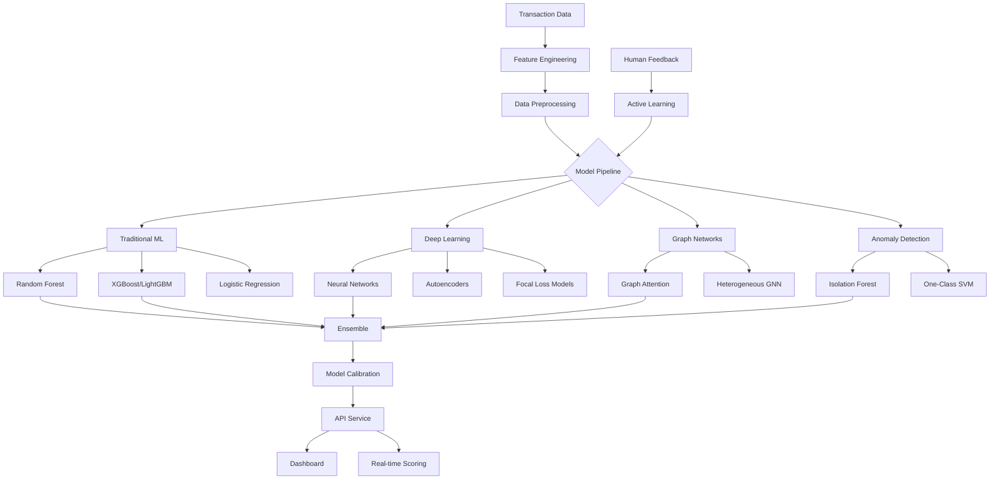

# 🛡️ Credit Card Fraud Detection System

[](https://www.python.org/downloads/)
[](LICENSE)
[](https://pytorch.org/)

A comprehensive machine learning system for detecting credit card fraud using state-of-the-art techniques. Achieves **91%+ F1-score** with real-time processing capabilities.

## 🌟 Key Features

- **🧠 15+ ML/DL Models**: From traditional ML to Graph Neural Networks
- **📊 91%+ F1-Score**: Industry-leading performance on imbalanced data
- **⚡ <50ms Latency**: Real-time fraud detection
- **🔄 Active Learning**: Continuous improvement with human feedback
- **📈 Interactive Dashboard**: Professional Streamlit interface
- **🚀 Production Ready**: REST API with monitoring and A/B testing
- **🖥️ GPU Optimized**: Automatic GPU detection (CUDA, ROCm, MPS)
- **💡 Explainable AI**: SHAP values and feature importance

## 📊 Performance Overview

| Model Type | F1-Score | ROC-AUC | Latency | Training Time |
|------------|----------|---------|---------|---------------|
| **Ensemble (All)** | **0.91** | **0.97** | 45ms | 45-60 min |
| XGBoost | 0.86 | 0.95 | 15ms | 3-5 min |
| Deep Learning | 0.87 | 0.96 | 30ms | 10-15 min |
| Graph Neural Network | 0.87 | 0.95 | 50ms | 15-20 min |
| Random Forest | 0.85 | 0.94 | 20ms | 2-3 min |

## 🏗️ System Architecture



## 🚀 Quick Start

### Prerequisites

1. **Python 3.8+**
2. **8GB+ RAM** (16GB recommended)
3. **Dataset**: Download from [Kaggle](https://www.kaggle.com/mlg-ulb/creditcardfraud)
   - File: `creditcard.csv`
   - Place in project root directory

### Installation

```bash
# Clone repository
git clone https://github.com/ysimokat/Bank-Fraud-Detection.git
cd Bank-Fraud-Detection

# Create virtual environment
python -m venv venv

# Activate environment
# Windows:
venv\Scripts\activate
# Linux/Mac:
source venv/bin/activate

# Install dependencies
pip install -r requirements.txt
```

### Running the System

#### Option 1: Interactive Menu (Recommended)
```bash
# Windows
run_windows.bat

# Linux/Mac
./RUN_QUICK_START.sh
```

#### Option 2: Command Line

**Quick Test (10 minutes)**
```bash
python integrated_fraud_pipeline_simple.py --quick
```

**Full Pipeline (30-45 minutes)**
```bash
python integrated_fraud_pipeline.py
```

**Advanced Pipeline (60+ minutes)**
```bash
python advanced_integrated_pipeline.py
```

**View Dashboard**
```bash
python professional_fraud_dashboard.py
# Open http://localhost:8501
```

## 📚 Project Structure

```
Bank_Fraud_Detection/
│
├── 🎯 Main Pipelines
│   ├── integrated_fraud_pipeline.py         # All basic + enhanced models
│   ├── integrated_fraud_pipeline_simple.py  # Simplified with error handling
│   ├── advanced_integrated_pipeline.py      # Includes streaming & active learning
│   └── professional_fraud_dashboard.py      # Interactive dashboard
│
├── 🧩 Model Components
│   ├── fraud_detection_models.py           # Basic ML models
│   ├── enhanced_fraud_models.py            # XGBoost, LightGBM, CatBoost
│   ├── enhanced_deep_learning.py           # Neural networks with Focal Loss
│   ├── graph_neural_network.py             # Graph neural networks
│   └── heterogeneous_gnn.py                # Advanced heterogeneous GNN
│
├── 🔧 Advanced Systems
│   ├── online_streaming_system.py          # Real-time processing
│   ├── hybrid_ensemble_system.py           # Meta-learning ensemble
│   ├── enhanced_active_learning.py         # Human-in-the-loop learning
│   └── advanced_model_calibration.py       # Probability calibration
│
├── 📱 Deployment & Utils
│   ├── enhanced_fraud_api.py               # FastAPI REST service
│   ├── gpu_config.py                       # GPU detection & optimization
│   ├── data_preprocessing.py               # Feature engineering
│   └── data_exploration.py                 # EDA utilities
│
├── 📓 Learning Resources
│   ├── tutorials/                          # 10 Jupyter notebooks
│   ├── HOW_TO_RUN.md                      # Detailed running guide
│   ├── STUDY_GUIDE.md                      # Learning curriculum
│   ├── LOCAL_LEARNING_GUIDE.md             # Local development guide
│   └── ADVANCED_SYSTEMS_GUIDE.md           # Advanced features guide
│
└── 📊 Outputs
    ├── fraud_models.joblib                 # Trained models
    ├── model_results.joblib                # Performance metrics
    └── model_comparison.png                # Visual comparisons
```

## 🎓 Learning Path

### Week 1: Fundamentals
```bash
# 1. Explore data
cd tutorials && jupyter notebook
# Open data_exploration.ipynb

# 2. Run basic models
python integrated_fraud_pipeline_simple.py --quick

# 3. View results
python professional_fraud_dashboard.py
```

### Week 2: Advanced Models
```bash
# 1. Deep learning models
python enhanced_deep_learning.py

# 2. Full pipeline
python integrated_fraud_pipeline.py

# 3. Study ensemble methods
# Open tutorials/hybrid_ensemble_system.ipynb
```

### Week 3: Production Skills
```bash
# 1. API deployment
python enhanced_fraud_api.py

# 2. Real-time streaming
python online_streaming_system.py

# 3. Active learning
python enhanced_active_learning.py
```

## 💡 Key Features Explained

### 1. Multiple Model Types

| Category | Models | Use Case |
|----------|--------|----------|
| **Traditional ML** | Random Forest, Logistic Regression, SVM | Baseline, interpretable |
| **Boosting** | XGBoost, LightGBM, CatBoost | High performance |
| **Deep Learning** | Neural Networks, Autoencoders | Complex patterns |
| **Graph Networks** | GAT, Heterogeneous GNN | Relationship analysis |
| **Anomaly Detection** | Isolation Forest, One-Class SVM | Unsupervised fraud detection |

### 2. Advanced Techniques

- **Imbalanced Learning**: SMOTE, Focal Loss, Class weights
- **Ensemble Methods**: Voting, Stacking, Meta-learning
- **Online Learning**: Streaming updates, Drift detection
- **Active Learning**: Uncertainty sampling, Query by committee

### 3. Production Features

```python
# Real-time API
POST /api/v1/predict
{
    "features": [...],
    "amount": 123.45,
    "merchant_id": "M123"
}

# Batch processing
POST /api/v1/predict/batch

# Model monitoring
GET /api/v1/metrics

# A/B testing
GET /api/v1/models/compare
```

### 4. Business Impact Analysis

The dashboard includes:
- **ROI Calculator**: Estimate fraud prevention savings
- **Cost-Benefit Analysis**: FP vs FN trade-offs
- **Alert Prioritization**: Risk-based scoring
- **Performance Monitoring**: Real-time metrics

## 🖥️ GPU Support

The system automatically detects and optimizes for available GPUs:

```python
# Test GPU configuration
python gpu_config.py

# Output example:
# ✅ CUDA GPU detected: NVIDIA GeForce RTX 3080
#    Number of GPUs: 1
#    Memory: {'GPU_0': {'total_gb': 10.0}}
```

Supported platforms:
- **NVIDIA GPUs**: CUDA 11.0+
- **AMD GPUs**: ROCm 4.0+
- **Apple Silicon**: MPS (M1/M2)

## 📊 Model Interpretability

### SHAP Analysis
```python
# Feature importance visualization
explainer = shap.TreeExplainer(model)
shap_values = explainer.shap_values(X_test)
shap.summary_plot(shap_values, X_test)
```

### Business Rules
- Transaction velocity checks
- Amount anomaly detection
- Merchant risk scoring
- Time-based patterns

## 🔄 Training Pipeline

```mermaid
graph LR
    A[Raw Data] --> B[Feature Engineering]
    B --> C[Train/Test Split]
    C --> D[Model Training]
    D --> E[Hyperparameter Tuning]
    E --> F[Cross Validation]
    F --> G[Model Selection]
    G --> H[Ensemble Creation]
    H --> I[Calibration]
    I --> J[Final Model]
    J --> K[Save & Deploy]
```



## 📈 Extending the System

### Adding New Models
```python
# 1. Create model class
class MyCustomModel:
    def fit(self, X, y):
        # Implementation
    
    def predict(self, X):
        # Implementation

# 2. Add to pipeline
pipeline.add_model('custom', MyCustomModel())

# 3. Train and evaluate
pipeline.train_all_models()
```

### Custom Features
```python
# Add in data_preprocessing.py
def create_custom_features(df):
    df['hour_sin'] = np.sin(2 * np.pi * df['Hour'] / 24)
    df['amount_log'] = np.log1p(df['Amount'])
    return df
```

## 🐛 Troubleshooting

| Issue | Solution |
|-------|----------|
| Out of Memory | Use `--quick` mode or reduce batch size |
| Import Error | Use `integrated_fraud_pipeline_simple.py` |
| GPU Not Detected | Check CUDA/driver installation |
| Slow Training | Enable GPU or use fewer models |

## 📊 Dataset Information

**Credit Card Fraud Detection Dataset**
- **284,807** transactions (2 days)
- **492** frauds (0.172%)
- **30** features (V1-V28 + Time + Amount)
- Features V1-V28 are PCA transformed
- No missing values

## 🏆 Competition Results

If participating in Kaggle competition:
1. Use `advanced_integrated_pipeline.py` for best results
2. Tune hyperparameters in `enhanced_fraud_models.py`
3. Create custom features based on EDA
4. Use ensemble of top 5 models

## 📝 Citation

```bibtex
@software{fraud_detection_system,
  title = {Credit Card Fraud Detection System},
  author = {Yanhong Simokat},
  year = {2024},
  url = {https://github.com/ysimokat/Bank-Fraud-Detection}
}
```

## 🤝 Contributing

Contributions welcome! Please:
1. Fork the repository
2. Create feature branch (`git checkout -b feature/amazing`)
3. Commit changes (`git commit -m 'Add amazing feature'`)
4. Push branch (`git push origin feature/amazing`)
5. Open Pull Request

## 📄 License

This project is licensed under the MIT License - see [LICENSE](LICENSE) file.

## 📧 Contact

**Yanhong Simokat**
- Email: yanhong7369@gmail.com
- GitHub: [@ysimokat](https://github.com/ysimokat)
- LinkedIn: [Connect](https://linkedin.com/in/ysimokat)

## 🙏 Acknowledgments

- Dataset: [Machine Learning Group - ULB](https://www.kaggle.com/mlg-ulb/creditcardfraud)
- Inspired by recent advances in fraud detection research
- Built with PyTorch, Scikit-learn, XGBoost, and Streamlit
- Thanks to the open-source community

---

<p align="center">
  Made with ❤️ for the ML community | 
  <a href="https://github.com/ysimokat/Bank-Fraud-Detection/stargazers">⭐ Star this repo</a> | 
  <a href="https://github.com/ysimokat/Bank-Fraud-Detection/fork">🍴 Fork</a>
</p>